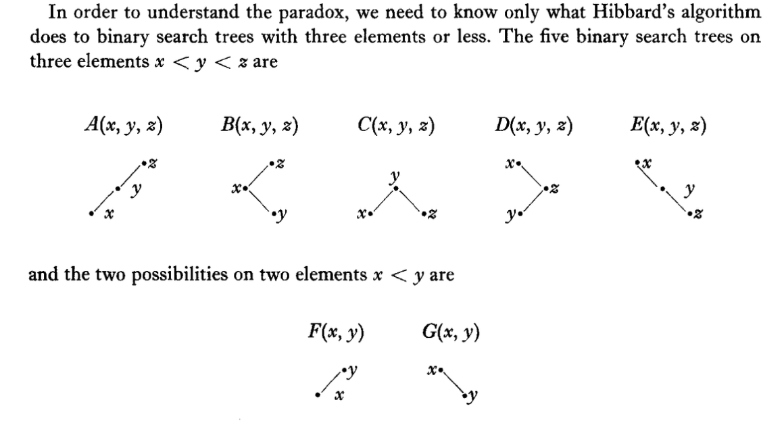
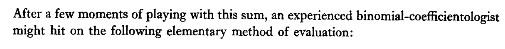

## Introduction

I have long been fascinated with the methods used in the 1978 paper by Arne Jonassen and Donald Knuth, ["A Trivial Algorithm Whose Analysis Isn't"](https://doi.org/10.1016/0022-0000(78)90020-X)[JonassenKnuth78]. The paper takes the *seemingly* simple situation of analyzing a 2 to 3 node search tree. The paper is an example of a "physics" approach to computer science: replace the process being studied by a system of equations, and then analyze invariants of those equations instead of analyzing the original process.

The paper contains a lot of results, and can be difficult approach. So I would like to share my reader's notes and a few highlights here.
 

## The set up

The paper studies the search trees given in the figure below. 



The entire description of a tree is the tree-letter ("A", ..., "G") and the distinct real numbers (in the range [0, 1]) instantiating the nodes x, y (and sometimes z). For a proper description and a few examples I refer the reader to the original paper.

The process we want to study is the the following. We start with an empty tree and insert 3 new keys (independently chosen uniformly at random from the range <code>[0, 1]</code>). We are then interested in the joint distribution of search tree shape and node key values as we alternate deleting one node uniformly at random (moving from a size 3 tree to a size 2 tree) and inserting a new key (chosen uniformly at random from the range <code>[0, 1]</code>).

Let <code>F<sub>k</sub>, G<sub>k</sub></code> denote the probability of observing a shape <code>F</code> or shape <code>G</code> tree after the k'th deletion. Let <code>A<sub>k</sub>, ..., E<sub>k</sub></code> denote the probability of observing a tree of the given shape after the <code>k</code>th key insertion.

The original goal was to show that the probability of seeing tree <code>C</code> after `k` insertions (<code>C<sub>k</sub></code>) isn't shrunk by deletions. That was meant to strengthen an earlier theorem establishing <code>1/3 = C<sub>1</sub> = C<sub>2</sub></code>. As the <code>C</code> shape is the nicest of the 3 node search trees, this was considered a positive thing to establish. The claimed "paradox" was the violation of intuition when it turned out <code>C<sub>3</sub> != 1/3</code>.


Note: one *could* just run the algorithm a very long time for a great number of repetitions. We demonstrate this in an appendix. But that would yield a merely empirical result. The bulk of this note is going to be repeating some of the deterministic calculations using current tools.


The essential difficulties of the paper are driven by a number of points:

  * We are analyzing an odd number of trees (`A` through `G`), so some things do not split up evenly.
  * Hibbard's deletion rule is asymmetric in when `F` or `G` trees are produced.
  * The state space is enormous, as it contains real number key values.

The final point turns out to be enough to sink simple methods. From the paper:

<blockquote>
From the form of the answer we shall derive, it will be clear that the problem itself is <em>intrinsically difficult</em>- no really simple derivation would be able to produce such a complicated answer, and the answer is right!
</blockquote>

I believe the suggestion is meant to be:

  * Any sort of finite Markov chain analysis is going to produce steady state probabilities that are rational numbers.
  * Equation 6.9 of the paper shows the steady state probabilities are given by rapidly converging sums, similar to those used to prove irrationality of other numbers.

I.e.: it is plausible that *none* of the common analysis methods *can even write down the answer*!

However, the irrationality is *not* explicitly claimed and not proven.

Let's work through some of the ideas!

## Preparation

To prepare we set up our Python environment, import `sympy`, and define some utility functions.


```python
# import packages and functions
import functools
import numpy as np
import pandas as pd
import sympy as sp
from mpmath import findpoly, mp
from tree_fns import (
    convert_coefs_to_float,
    delete_node,
    initial_state,
    insert_node,
    keep_low_degree_terms,
    make_discrete_matrices,
    safe_subs,
    solve_for_F,
)

rng = np.random.default_rng(2025)
```

For simplicity, let's study tree shape <code>F</code>, instead of tree shape <code>C</code>. Define the density function <code>f<sub>k</sub>(x, y)</code> as the probability density of seeing tree `F` with node values `0 <= x < y <= 1` after the `k`th deletion step. We will also use `F` to denote the limiting probability of observing the `F` tree shape.

Recurrence 3.2 generates <code>f<sub>k</sub>(x, y)</code> and can be translated into Python as follows.


```python
# implement recurrence 3.2 from the paper


def transform_f_k(f_prev):
    """Transform f_k(x, y) to f_{k+1}(x, y)"""
    x, y, t = sp.symbols("x y t")
    return sp.expand(
        (
            sp.Integer(2)
            - sp.Integer(2) * x
            + f_prev
            + sp.integrate(safe_subs(f_prev, x, t), (t, 0, x))
            + sp.integrate(safe_subs(f_prev, y, t), (t, x, y))
        )
        / sp.Integer(3)
    )


@functools.cache
def build_f_poly(k: int):
    """Build f_k(x, y)"""
    if k <= 0:
        return sp.Integer(1)
    f_prev = build_f_poly(k - 1)
    return transform_f_k(f_prev)
```

The first few values of <code>f<sub>k</sub>(x, y)</code> are:


```python
# compute f1
build_f_poly(0)
```


$\displaystyle 1$


```python
# compute f2
build_f_poly(1)
```


$\displaystyle - \frac{2 x}{3} + \frac{y}{3} + 1$


```python
# compute f3
build_f_poly(2)
```


$\displaystyle \frac{x^{2}}{18} - \frac{x y}{9} - \frac{8 x}{9} + \frac{y^{2}}{18} + \frac{4 y}{9} + 1$


Equation 2.6 of the paper states <code>F<sub>k</sub></code> is just an appropriate integral of <code>f<sub>k</sub>(x, y)</code> to eliminate the `x` and `y` variables.


```python
# implement equation 2.6 from the paper


def compute_F_k(f_poly):
    """Equation 2.6"""
    return sp.integrate(
        sp.integrate(f_poly, (sp.Symbol("x"), 0, sp.Symbol("y"))),
        (sp.Symbol("y"), 0, 1),
    )
```

The first few probabilities of seeing tree shape `F` are then as follows.


```python
compute_F_k(build_f_poly(0))
```


$\displaystyle \frac{1}{2}$


```python
compute_F_k(build_f_poly(1))
```


$\displaystyle \frac{1}{2}$


The above was the content of the theorems of Hibbard and later Knott. However, <code>F<sub>3</sub></code> departs from the pattern.


```python
compute_F_k(build_f_poly(2))
```


$\displaystyle \frac{109}{216}$


```python
compute_F_k(build_f_poly(2)).n()
```


$\displaystyle 0.50462962962963$


Here is the paradox: given the earlier proof (and confirmation) that the first two values are 1/2, why is the 3rd value not? The paper shows that the "paradox" was actually just an unjustified independence assumption.


### Some checks


Before going on, we confirm our code by checking it against a number of the paper's documented calculations.


```python
# check published values
assert build_f_poly(0) == 1
assert build_f_poly(1) == (
    1 - sp.Symbol("x") * sp.Rational(2, 3) + sp.Symbol("y") / sp.Integer(3)
)
assert (
    build_f_poly(2)
    == (
        1
        - sp.Symbol("x") * sp.Rational(8, 9)
        + sp.Symbol("y") * sp.Rational(4, 9)
        + (sp.Symbol("x") - sp.Symbol("y")) ** 2 / sp.Integer(18)
    ).expand()
)
assert compute_F_k(build_f_poly(0)) == sp.Rational(1, 2)
assert compute_F_k(build_f_poly(1)) == sp.Rational(1, 2)
assert compute_F_k(build_f_poly(2)) == sp.Rational(109, 216)
assert compute_F_k(build_f_poly(3)) > compute_F_k(build_f_poly(2))
```

## The evolution of the "see `F`" probability

As we said, we can just plug in larger k to estimate the steady state probability that our algorithm is observed in state `F` instead of state `G` for 2-node trees.

For example after 10 steps the probability <code>F<sub>10</sub></code> is exactly.


```python
compute_F_k(build_f_poly(10)).n()
```


$\displaystyle 0.516089543924779$


This already matches Jonassen's and Knuth's published value to 3 to 4 digits (depending on rounding rules).


```python
# equation 7.14 published value
f_inf_paper = sp.Float("0.51617_50470_25177_89347")
assert abs(f_inf_paper - compute_F_k(build_f_poly(10))).n() < 0.5e-3
```

We want to reproduce this full result.

## Working towards the solution

If we print our first few <code>f<sub>k</sub>(x, y)</code> with floating point coefficients, it becomes easier to see:

  * The lower power terms are converging to something
  * The the high power terms have small magnitude coefficients.


```python
convert_coefs_to_float(build_f_poly(1))
```


$\displaystyle - 0.666666666666667 x + 0.333333333333333 y + 1.0$


```python
convert_coefs_to_float(build_f_poly(2))
```


$\displaystyle 0.0555555555555556 x^{2} - 0.111111111111111 x y - 0.888888888888889 x + 0.0555555555555556 y^{2} + 0.444444444444444 y + 1.0$


```python
convert_coefs_to_float(build_f_poly(3))
```


$\displaystyle 0.0925925925925926 x^{2} - 0.185185185185185 x y - 0.962962962962963 x + 0.00617283950617284 y^{3} + 0.0925925925925926 y^{2} + 0.481481481481481 y + 1.0$


```python
convert_coefs_to_float(build_f_poly(4))
```


$\displaystyle - 0.00051440329218107 x^{4} + 0.111111111111111 x^{2} + 0.00205761316872428 x y^{3} - 0.222222222222222 x y - 0.987654320987654 x + 0.00051440329218107 y^{4} + 0.0123456790123457 y^{3} + 0.111111111111111 y^{2} + 0.493827160493827 y + 1.0$


This is why the `F` estimate is converging to a value quickly.


## Using a fixed-point solver

The paper's next idea is to solve for a fixed-point or eigen-function of the "to the next step" transform. The paper introduces a related recurrence in Equation 3.4. We do not need to do this as the fixed point solver also works fine with the earlier Equation 3.2 function `transform_f_k()` (in addition to working with the Equation 3.4 form). We have the freedom of leaving more of the work to the machine.

We will use the `sympy` computer algebra system to symbolically solve for the low degree terms of the power series approximation of <code>f<sub>&infin;</sub>(x, y)</code> such that <code>f<sub>&infin;</sub>(x, y) ~ transform_f_k(f<sub>&infin;</sub>(x, y))</code>.

### Building the fixed-point solver

First let's build a list symbolic polynomial representing the lower degree terms of a two variable power series.


```python
def build_initial_free_power_series(degree_bound: int):
    # build map of monomial powers to coefficient name
    x, y = sp.symbols("x y")
    coef_names = {
        (x_power, y_power): (
            sp.Symbol("c_{x^{" + str(x_power) + "} y^{+ " + str(y_power) + "}}"),
            x**x_power * y**y_power,
        )
        for x_power in range(degree_bound + 1)
        for y_power in range(degree_bound + 1)
        if x_power + y_power <= degree_bound
    }
    # build a general polynomial over these monomials
    symbolic_rep = sum(
        [coef_name * monomial_term for coef_name, monomial_term in coef_names.values()],
        0,
    )
    return coef_names, symbolic_rep
```


```python
coef_names, symbolic_rep = build_initial_free_power_series(2)

symbolic_rep.as_poly(gens=sp.symbols("x y"))
```


$\displaystyle \operatorname{Poly}{\left( c_{x^{2} y^{0}} x^{2} + c_{x^{1} y^{1}} xy + c_{x^{1} y^{0}} x + c_{x^{0} y^{2}} y^{2} + c_{x^{0} y^{1}} y + c_{x^{0} y^{0}}, x, y, domain=\mathbb{Z}\left[c_{x^{0} y^{0}}, c_{x^{0} y^{1}}, c_{x^{0} y^{2}}, c_{x^{1} y^{0}}, c_{x^{1} y^{1}}, c_{x^{2} y^{0}}\right] \right)}$


Now we run this polynomial through our transform, retaining only the degree bounded terms, and re-collecting the transformed coefficients in terms of the variables `x` and `y`.


```python
def apply_transform_and_convert(transform, *, symbolic_rep):
    # run this polynomial through the integral transform
    transformed_rep = transform(symbolic_rep)
    # convert to polynomial specialized representation
    return transformed_rep.as_poly(gens=sp.symbols("x y"))
```


```python
transformed_rep = apply_transform_and_convert(transform_f_k, symbolic_rep=symbolic_rep)

transformed_rep
```


$\displaystyle \operatorname{Poly}{\left( \left(- \frac{c_{x^{0} y^{2}}}{9} - \frac{c_{x^{1} y^{1}}}{6} - \frac{2 c_{x^{2} y^{0}}}{9}\right) x^{3} + \left(\frac{c_{x^{1} y^{1}}}{6} + \frac{c_{x^{2} y^{0}}}{3}\right) x^{2}y + \left(- \frac{c_{x^{0} y^{1}}}{6} - \frac{c_{x^{1} y^{0}}}{6} + \frac{c_{x^{2} y^{0}}}{3}\right) x^{2} + \left(\frac{c_{x^{0} y^{2}}}{3} + \frac{c_{x^{1} y^{1}}}{6}\right) xy^{2} + \left(\frac{c_{x^{0} y^{1}}}{3} + \frac{c_{x^{1} y^{0}}}{3} + \frac{c_{x^{1} y^{1}}}{3}\right) xy + \left(\frac{c_{x^{1} y^{0}}}{3} - \frac{2}{3}\right) x + \frac{c_{x^{0} y^{2}}}{9} y^{3} + \left(\frac{c_{x^{0} y^{1}}}{6} + \frac{c_{x^{0} y^{2}}}{3}\right) y^{2} + \left(\frac{c_{x^{0} y^{0}}}{3} + \frac{c_{x^{0} y^{1}}}{3}\right) y + \frac{c_{x^{0} y^{0}}}{3} + \frac{2}{3}, x, y, domain=\mathbb{Q}\left[c_{x^{0} y^{0}}, c_{x^{0} y^{1}}, c_{x^{0} y^{2}}, c_{x^{1} y^{0}}, c_{x^{1} y^{1}}, c_{x^{2} y^{0}}\right] \right)}$


We restrict ourselves to only the original terms (dropping the new higher degree terms) and re-write the simultaneous equations as a table. In this table we solve for coefficients such that the first column equals the second column.


```python
eqns = {
    coef_names[monom][0]: coef
    for monom, coef in zip(transformed_rep.monoms(), transformed_rep.coeffs())
    if monom in coef_names
}

sp.Matrix([(k, v) for k, v in eqns.items()])
```


$\displaystyle \left[\begin{matrix}c_{x^{2} y^{0}} & - \frac{c_{x^{0} y^{1}}}{6} - \frac{c_{x^{1} y^{0}}}{6} + \frac{c_{x^{2} y^{0}}}{3}\\c_{x^{1} y^{1}} & \frac{c_{x^{0} y^{1}}}{3} + \frac{c_{x^{1} y^{0}}}{3} + \frac{c_{x^{1} y^{1}}}{3}\\c_{x^{1} y^{0}} & \frac{c_{x^{1} y^{0}}}{3} - \frac{2}{3}\\c_{x^{0} y^{2}} & \frac{c_{x^{0} y^{1}}}{6} + \frac{c_{x^{0} y^{2}}}{3}\\c_{x^{0} y^{1}} & \frac{c_{x^{0} y^{0}}}{3} + \frac{c_{x^{0} y^{1}}}{3}\\c_{x^{0} y^{0}} & \frac{c_{x^{0} y^{0}}}{3} + \frac{2}{3}\end{matrix}\right]$


This is in a good form to solve as a linear system over the symbols.


```python
coef_values = sp.solve(
    [derived_coef - original_coef for original_coef, derived_coef in eqns.items()]
)

sp.Matrix([(k, v) for k, v in coef_values.items()])
```


$\displaystyle \left[\begin{matrix}c_{x^{0} y^{0}} & 1\\c_{x^{0} y^{1}} & \frac{1}{2}\\c_{x^{0} y^{2}} & \frac{1}{8}\\c_{x^{1} y^{0}} & -1\\c_{x^{1} y^{1}} & - \frac{1}{4}\\c_{x^{2} y^{0}} & \frac{1}{8}\end{matrix}\right]$


We now have the coefficients for the low degree approximation of the fixed point of the transform! It is then just a matter of assembling the solution back into a polynomial. We collect all the steps here.


```python
def solve_for_initial_invariant(degree_bound: int, *, transform):
    # build symbolic representation of low degree terms of power series
    coef_names, symbolic_rep = build_initial_free_power_series(degree_bound)
    # run this polynomial through the integral transform
    transformed_rep = apply_transform_and_convert(transform, symbolic_rep=symbolic_rep)
    # equate new coefficients to original symbols and solve the system
    coef_values = sp.solve(
        [
            coef_names[monom][0] - new_expression
            for monom, new_expression in zip(
                transformed_rep.monoms(), transformed_rep.coeffs()
            )
            if monom in coef_names
        ]
    )
    # re-assemble result into initial invariant polynomial
    return sum(
        [
            coef_values[coef_name] * coef_term
            for coef_name, coef_term in coef_names.values()
        ],
        0,
    )
```

### Applying the fixed-point method

Let's apply the entire procedure to read off the low degree approximation of the transform fixed point.


```python
initial_invariant_2 = solve_for_initial_invariant(
    degree_bound=2, transform=transform_f_k
)

initial_invariant_2
```


$\displaystyle \frac{x^{2}}{8} - \frac{x y}{4} - x + \frac{y^{2}}{8} + \frac{y}{2} + 1$


We show the difference between `initial_invariant_2` and `transform_f_k(initial_invariant_2)` is only terms of degree greater than 2.


```python
transform_f_k(initial_invariant_2) - initial_invariant_2
```


$\displaystyle \frac{y^{3}}{72}$


```python
assert (
    keep_low_degree_terms(
        transform_f_k(initial_invariant_2) - initial_invariant_2, degree_bound=2
    )
    == 0
)
```

This very low degree approximation doesn't give us more than 2 digits of the correct answer.


```python
compute_F_k(initial_invariant_2).n()
```


$\displaystyle 0.510416666666667$


```python
assert abs(compute_F_k(initial_invariant_2) - f_inf_paper) < 1e-2
```

Using a degree 30 bound gives us as least as many digits as in the original paper (subject to the usual rounding rules).


```python
f_n_estimate = compute_F_k(solve_for_initial_invariant(30, transform=transform_f_k))

f_n_estimate
```


$\displaystyle \frac{20833900370755957319187311387714780525504731}{40362083542832951162678241911761797120000000}$


```python
f_n_estimate.n(25)
```


$\displaystyle 0.5161750470251778934693677$


```python
# confirm exact close to equation 7.14 published value
assert abs(f_n_estimate - f_inf_paper).n() < 0.5e-20
```

## The exact solution

Jonassen and Knuth found that they could solve the recurrence symbolically, and write the solution in terms of the similarly structured "[modified Bessel functions](https://en.wikipedia.org/wiki/Bessel_function#Modified_Bessel_functions)." This let them write down the exact limiting probability of seeing `F` (instead of `G`) at a given moment as the following.


```python
# result 7.12
I0 = sp.besseli(sp.Integer(0), sp.Integer(1))
I1 = sp.besseli(sp.Integer(1), sp.Integer(1))
f_exact = (
    sp.Rational(4, 3) * sp.exp(sp.Integer(1)) * I0
    - sp.Integer(2) * sp.exp(sp.Integer(1)) * I1
    - sp.Integer(1)
)

f_exact
```


$\displaystyle - 2 e I_{1}\left(1\right) - 1 + \frac{4 e I_{0}\left(1\right)}{3}$


The modified Bessel functions were probably one of the places they used [MACSYMA](https://en.wikipedia.org/wiki/Macsyma).

Let's concede, the authors didn't expect all readers to move through all the steps.



The quality of their result proves the methodology.


```python
f_exact.n(50)
```


$\displaystyle 0.51617504702517789346936764901499385774157016076124$


And the estimate does in fact match this to a great number of digits.


```python
# confirm estimate close to symbolic solution
assert abs(f_n_estimate - f_exact).n() < 0.5e-28
# confirm exact close to equation 7.14 published value
assert abs(f_inf_paper - f_exact).n() < 0.5e-20
```

## Conclusion

The Jonassen and Knuth paper remains a virtuoso demonstration of combinatorics and calculation. The functional analysis application of fixed point methods is very powerful, and in a sense natural (despite the difficulty of the entailed later steps).

We automated a repeat of some of the calculations by settling for an approximation. The newer tools of [Marko Petkovsek, Herbert Wilf and Doron Zeilberger, *A=B*, A K Peters/CRC Press, 1996](https://www2.math.upenn.edu/~wilf/AeqB.html) and 
[Philippe Flajolet, Robert Sedgewick, *Analytic Combinatorics*, Cambridge, 2009](https://www.cambridge.org/core/books/analytic-combinatorics/7E37474C43E9B95C90BEDE082CF28708) likely make a mechanical reproduction of the combinatorial steps of the paper also achievable.

## Appendices

### Appendix: trying the obvious simulation solution

We can quickly implement the obvious simulate and collect empirical averages solution.

The code looks like the following.


```python
state = initial_state(rng=rng)
print(state)
state = insert_node(state, rng=rng)
print(state)
state = delete_node(state, rng=rng)
print(state)
state = insert_node(state, rng=rng)
print(state)
state = delete_node(state, rng=rng)
print(state)
```

    ('G', 0.3820097409171477, 0.9944578051677608)
    ('D', 0.3820097409171477, 0.8372552761899896, 0.9944578051677608)
    ('G', 0.3820097409171477, 0.8372552761899896)
    ('E', 0.3820097409171477, 0.8372552761899896, 0.975809010156957)
    ('G', 0.3820097409171477, 0.975809010156957)


Estimating probability `F` is then just a matter of running the sequence enough times and long enough.


```python
def run_simulation(
    *, rng, n_repetitions: int = 100, n_warmup: int = 10000, n_steps: int = 10000
):
    n_F = 0
    n_G = 0
    for rep in range(n_repetitions):
        state = initial_state(rng=rng)
        # warm up
        for rep in range(n_warmup):
            state = insert_node(state, rng=rng)
            state = delete_node(state, rng=rng)
        # get stats
        for rep in range(n_steps):
            state = insert_node(state, rng=rng)
            state = delete_node(state, rng=rng)
            if state[0] == "F":
                n_F += 1
            else:
                n_G += 1
    return n_F / (n_F + n_G)
```


```python
run_simulation(rng=rng)
```


    0.51727


This doesn't give us a lot of digits of the correct answer, and very little insight. Also the returned result itself is subject to sampling error (which can be decreased by using longer runs).


```python
run_simulation(rng=rng)
```


    0.517413


### Appendix: It isn't obvious `F` is irrational


#### Why `F` seems irrational

As hinted in the paper, there isn't an obvious *small* algebraic expression for the probability `F`. For instance, `mpmath.findpoly()` fails to find a low degree polynomial with small magnitude integer coefficients with `F` as a root.


```python
# finding -X**2 + 2 == 0 for sqrt(2) as an example
mp.dps = 100  # Set precision
sqrt_2_relation = findpoly(sp.sqrt(2).n(200), n=8, maxcoeff=10**6, maxsteps=100000)
assert sqrt_2_relation is not None  # something found
print(sqrt_2_relation)
```

    [-1, 0, 2]


```python
# failing to find a small minimal polynomial for F
mp.dps = 100  # Set precision
F_reln = findpoly(f_exact.n(200), n=8, maxcoeff=10**6, maxsteps=100000)
assert F_reln is None  # nothing found
print(F_reln)
```

    None


Though this is not the same as actually proving irrationality of the value.

Equation 6.9 shows:

$$
F = \sum_{k = 0}^{\infty} \frac{1}{2^{k} (k + 2)!} \left( \binom{2 k  - 2}{k} - \binom{2 k - 2}{k - 4} \right)
$$

(using the convention that $\binom{a}{b}$ is $0$ for $a <= 0$ or $b < 0$).

Our guess is the authors intended to exploit the rapid convergence of Equation 6.9 to prove the irrationality of `F`.

Let's take a look at partial sums <code>F<sub>n</sub>()</code> of `F`.


```python
@functools.cache
def F_n(n: int):
    if n < 0:
        return 0
    F_n_1 = F_n(n - 1)
    n = sp.Integer(n)
    return F_n_1 + (
        (1 / (sp.Integer(2) ** n * sp.factorial(n + 2)))
        * (sp.binomial(2 * n - 2, n) - sp.binomial(2 * n - 2, n - 4))
    )
```


```python
# show error is shrinking fast
F_errors = [(f_exact - F_n(n)).n() for n in range(10)]

F_errors
```


    [0.0161750470251779,
     0.0161750470251779,
     0.00575838035851123,
     0.00159171369184456,
     0.000376435914066782,
     7.88168664477347e-5,
     1.48752741858300e-5,
     2.56059715761128e-6,
     4.05528677673011e-7,
     5.94964305990971e-8]


These appear to get quite small quickly. 

#### Showing `e` is irrational (a warm up)

To explain the method, here is how once shows that `e` is irrational. Define

$$
e_{n} = \sum_{k = 0}^{n} 1/(k!)
$$

Find integers <code>z<sub>k</sub></code> such that:

  * $z_{n} e_{n}$ is integral
  * $z_{n} (e - e_{n})$ goes to zero.

For example, one can prove $z_{n} = n!$ works. We just show a few example values.


```python
@functools.cache
def e_n(n: int):
    if n < 0:
        return 0
    return e_n(n - 1) + 1 / sp.factorial(sp.Integer(n))
```


```python
# show partial sums are integers
[sp.factorial(sp.Integer(n)) * e_n(n) for n in range(10)]
```


    [1, 2, 5, 16, 65, 326, 1957, 13700, 109601, 986410]


```python
# show error is shrinking, even when multiplied by scaling factor
[
    (sp.factorial(sp.Integer(n)) * (sp.exp(sp.Integer(1)) - e_n(n))).n()
    for n in range(10)
]
```


    [1.71828182845905,
     0.718281828459045,
     0.436563656918090,
     0.309690970754271,
     0.238763883017086,
     0.193819415085428,
     0.162916490512569,
     0.140415433587986,
     0.123323468703890,
     0.109911218335008]


The proof of the irrationality of `e` could then be completed by the following steps.

  * Assume, for the sake of contradiction, $e = a/b$ for positive integers $a, b$.
  * Prove $n! (e - e_{n}) \rightarrow 0$ as $n$ increases.
  * Note as $b e$ is an integer and $n! e_{n}$ is always an integer. Therefore $n! (e - e_{n}) b$ is also always an integer.
  * $n! (e - e_{n}) \rightarrow 0$ implies $0 < n! (e - e_{n}) b < 1$ for large enough $n$, contradicting the integrality of $n! (e - e_{n}) b$.

#### Back to `F`

The earlier sort of proof will not work directly for `F`. It turns out the integers required to make $z_{n} F_{n}$ an integer seem to grow too fast to allow $z_{n} (F - F_{n})$ to be small. We are going to show even the smallest possible $z_{n} = denominator(F_{n})$ (denoted as `sp.fraction(F_n(n))[1]` in `sympy`) grows too fast.


```python
# show even observed denominator is growing faster than 1/error, ruining the proof strategy
[(sp.fraction(F_n(n))[1] * (f_exact - F_n(n))).n() for n in range(10)]
```


    [0.0323500940503558,
     0.0323500940503558,
     0.552804514417078,
     0.764022572085389,
     2.16827086502467,
     3.17789605517266,
     38.3853475310505,
     11.8936255558910,
     188.362555589097,
     11.2588189437063]


In my opinion, the authors likely wanted a proof of irrationality using this sort of method. However I don't think they had such. There are other ways to prove irrationality.

### Appendix: discrete Markov chain approximation

Another idea to estimate the probability `F` would discretize the system and estimate the probabilities from a finite Markov chain. This is an alternative to a direct simulation that eliminates sampling variance.

However, the method does not work well, as the smaller finite Markov chains end up not imitating the limiting probabilities very well.

As an example let's use a 3 numeric state chain.


```python
deletion_map, insertion_map, states_2, states_3 = make_discrete_matrices(3)
```

In this simulation we are only allowing keys 0.0, 0.5, and 1.0. We enforce the tree insertion, deletion rules not allowing duplicate keys.

The 3 node to 2 node deletion pattern is encoded as follows.


```python
pd.DataFrame(deletion_map.toarray(), index=states_2, columns=states_3)
```


<div>
<style scoped>
    .dataframe tbody tr th:only-of-type {
        vertical-align: middle;
    }

    .dataframe tbody tr th {
        vertical-align: top;
    }

    .dataframe thead th {
        text-align: right;
    }
</style>
<table border="1" class="dataframe">
  <thead>
    <tr style="text-align: right;">
      <th></th>
      <th>A(0.0,0.5,1.0)</th>
      <th>B(0.0,0.5,1.0)</th>
      <th>C(0.0,0.5,1.0)</th>
      <th>D(0.0,0.5,1.0)</th>
      <th>E(0.0,0.5,1.0)</th>
    </tr>
  </thead>
  <tbody>
    <tr>
      <th>F(0.0,0.5)</th>
      <td>0.333333</td>
      <td>0.000000</td>
      <td>0.333333</td>
      <td>0.000000</td>
      <td>0.000000</td>
    </tr>
    <tr>
      <th>F(0.0,1.0)</th>
      <td>0.333333</td>
      <td>0.333333</td>
      <td>0.333333</td>
      <td>0.000000</td>
      <td>0.000000</td>
    </tr>
    <tr>
      <th>F(0.5,1.0)</th>
      <td>0.333333</td>
      <td>0.333333</td>
      <td>0.000000</td>
      <td>0.000000</td>
      <td>0.000000</td>
    </tr>
    <tr>
      <th>G(0.0,0.5)</th>
      <td>0.000000</td>
      <td>0.333333</td>
      <td>0.000000</td>
      <td>0.333333</td>
      <td>0.333333</td>
    </tr>
    <tr>
      <th>G(0.0,1.0)</th>
      <td>0.000000</td>
      <td>0.000000</td>
      <td>0.000000</td>
      <td>0.333333</td>
      <td>0.333333</td>
    </tr>
    <tr>
      <th>G(0.5,1.0)</th>
      <td>0.000000</td>
      <td>0.000000</td>
      <td>0.333333</td>
      <td>0.333333</td>
      <td>0.333333</td>
    </tr>
  </tbody>
</table>
</div>


The above is a matrix that operates from the left on a right column vector. This is standard for linear algebra, instead of the "operator on the left" notation used in the Markov chain community.

The 2 node to 3 node insertion pattern is encoded as follows. With only three numeric levels the key generation becomes deterministic. This effect goes away as we add more numeric states.


```python
pd.DataFrame(insertion_map.toarray(), index=states_3, columns=states_2)
```


<div>
<style scoped>
    .dataframe tbody tr th:only-of-type {
        vertical-align: middle;
    }

    .dataframe tbody tr th {
        vertical-align: top;
    }

    .dataframe thead th {
        text-align: right;
    }
</style>
<table border="1" class="dataframe">
  <thead>
    <tr style="text-align: right;">
      <th></th>
      <th>F(0.0,0.5)</th>
      <th>F(0.0,1.0)</th>
      <th>F(0.5,1.0)</th>
      <th>G(0.0,0.5)</th>
      <th>G(0.0,1.0)</th>
      <th>G(0.5,1.0)</th>
    </tr>
  </thead>
  <tbody>
    <tr>
      <th>A(0.0,0.5,1.0)</th>
      <td>0.0</td>
      <td>0.0</td>
      <td>1.0</td>
      <td>0.0</td>
      <td>0.0</td>
      <td>0.0</td>
    </tr>
    <tr>
      <th>B(0.0,0.5,1.0)</th>
      <td>0.0</td>
      <td>1.0</td>
      <td>0.0</td>
      <td>0.0</td>
      <td>0.0</td>
      <td>0.0</td>
    </tr>
    <tr>
      <th>C(0.0,0.5,1.0)</th>
      <td>1.0</td>
      <td>0.0</td>
      <td>0.0</td>
      <td>0.0</td>
      <td>0.0</td>
      <td>1.0</td>
    </tr>
    <tr>
      <th>D(0.0,0.5,1.0)</th>
      <td>0.0</td>
      <td>0.0</td>
      <td>0.0</td>
      <td>0.0</td>
      <td>1.0</td>
      <td>0.0</td>
    </tr>
    <tr>
      <th>E(0.0,0.5,1.0)</th>
      <td>0.0</td>
      <td>0.0</td>
      <td>0.0</td>
      <td>1.0</td>
      <td>0.0</td>
      <td>0.0</td>
    </tr>
  </tbody>
</table>
</div>


We can compose these operators to get the 2 node to 2 node transition probabilities.


```python
two_to_two_map = deletion_map @ insertion_map
pd.DataFrame(two_to_two_map.toarray(), index=states_2, columns=states_2)
```


<div>
<style scoped>
    .dataframe tbody tr th:only-of-type {
        vertical-align: middle;
    }

    .dataframe tbody tr th {
        vertical-align: top;
    }

    .dataframe thead th {
        text-align: right;
    }
</style>
<table border="1" class="dataframe">
  <thead>
    <tr style="text-align: right;">
      <th></th>
      <th>F(0.0,0.5)</th>
      <th>F(0.0,1.0)</th>
      <th>F(0.5,1.0)</th>
      <th>G(0.0,0.5)</th>
      <th>G(0.0,1.0)</th>
      <th>G(0.5,1.0)</th>
    </tr>
  </thead>
  <tbody>
    <tr>
      <th>F(0.0,0.5)</th>
      <td>0.333333</td>
      <td>0.000000</td>
      <td>0.333333</td>
      <td>0.000000</td>
      <td>0.000000</td>
      <td>0.333333</td>
    </tr>
    <tr>
      <th>F(0.0,1.0)</th>
      <td>0.333333</td>
      <td>0.333333</td>
      <td>0.333333</td>
      <td>0.000000</td>
      <td>0.000000</td>
      <td>0.333333</td>
    </tr>
    <tr>
      <th>F(0.5,1.0)</th>
      <td>0.000000</td>
      <td>0.333333</td>
      <td>0.333333</td>
      <td>0.000000</td>
      <td>0.000000</td>
      <td>0.000000</td>
    </tr>
    <tr>
      <th>G(0.0,0.5)</th>
      <td>0.000000</td>
      <td>0.333333</td>
      <td>0.000000</td>
      <td>0.333333</td>
      <td>0.333333</td>
      <td>0.000000</td>
    </tr>
    <tr>
      <th>G(0.0,1.0)</th>
      <td>0.000000</td>
      <td>0.000000</td>
      <td>0.000000</td>
      <td>0.333333</td>
      <td>0.333333</td>
      <td>0.000000</td>
    </tr>
    <tr>
      <th>G(0.5,1.0)</th>
      <td>0.333333</td>
      <td>0.000000</td>
      <td>0.000000</td>
      <td>0.333333</td>
      <td>0.333333</td>
      <td>0.333333</td>
    </tr>
  </tbody>
</table>
</div>


And then we can solve for the limiting distribution.


```python
solve_for_F(deletion_map=deletion_map, insertion_map=insertion_map, states_2=states_2)
```


    0.54166666666667


This is the exact limiting distribution of our finite Markov chain. However, it turns out this isn't a very good approximation of the original problem with real-number key values.

We can up the number of numeric states and get better estimates.


```python
solns = {}
for k in (5, 10, 25, 50, 75, 100):
    deletion_map, insertion_map, states_2, states_3 = make_discrete_matrices(k)
    F_discrete = solve_for_F(
        deletion_map=deletion_map, insertion_map=insertion_map, states_2=states_2
    )
    del deletion_map
    del insertion_map
    solns[k] = F_discrete

solns
```


    {5: 0.5275002143347081,
     10: 0.520880327684369,
     25: 0.51788206641448,
     50: 0.5170027974558239,
     75: 0.5167213791483427,
     100: 0.5165827630782599}


The discrete solution strategy turns out to be very inefficient compared to the earlier analytical methods. It takes a lot of CPU and memory to even get even 2 to 3 digits of the probability `F` correct.

## References

[JonassenKnuth78] Jonassen, Arne T. and Donald E. Knuth, ["A Trivial Algorithm Whose Analysis Isn't"](https://doi.org/10.1016/0022-0000(78)90020-X), *Journal of Computer and System Sciences*, Volume 16, Issue 3, 1978, Pages 301-322. (Re-collected in [Donald E. Knuth, *Selected Papers on Analysis of Algorithms*, CSLI Lecture Notes, no. 102., ISBN 1-57586-212-3, 2000](https://www-cs-faculty.stanford.edu/~knuth/aa.html)).
